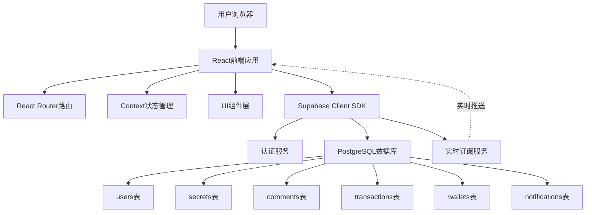

## 产品概述

一个神秘森林风格的匿名树洞社交平台，用户可以匿名分享秘密并设定点数价格，其他用户通过随机"挖掘"方式发现秘密，选择是否付费支持。所有用户在界面上统一显示为"momo"以保护隐私。秘密支持评论功能，洞主收到评论时会获得提醒通知。

## 核心功能

### 倾诉树洞

用户匿名发布秘密，设定点数价格（虚拟货币），秘密进入公共池等待被发现。可查看自己发布的树洞收益和评论。

### 倾听树洞

随机推送未查看过的树洞秘密预览，用户选择是否支付点数解锁完整内容，支付后原作者获得点数收益。

### 评论互动

用户可在秘密下方添加匿名评论（显示为"momo"），洞主收到评论时获得实时提醒通知。

### 用户系统

匿名注册登录，个人钱包（点数充值、消费、收益），历史记录（发布的树洞、购买的树洞、收到的评论）。

### 隐私保护

所有用户名在界面上统一显示为"momo"，真实用户ID仅在后端使用，确保完全匿名。

## 技术栈

### 前端技术栈

- **框架**: React 18 + TypeScript
- **样式**: Tailwind CSS + CSS Modules
- **路由**: React Router v6
- **状态管理**: React Context API + Custom Hooks
- **HTTP客户端**: Supabase Client SDK
- **表单验证**: React Hook Form + Zod
- **动画效果**: CSS动画 + Framer Motion

### 后端技术栈

- **BaaS平台**: Supabase
- PostgreSQL 数据库
- Row Level Security (RLS) 数据安全
- Realtime 实时订阅（用于评论通知）
- Auth 用户认证
- **积分系统**: 完全虚拟的点数系统，无需对接真实支付

### 部署方案

- **前端部署**: 使用 lighthouse 集成进行云端部署
- **成本优化**: Supabase免费计划（500MB数据库 + 1GB存储 + 50K月活用户）

## 实现方案

### 架构设计思路

采用经典的**客户端-BaaS架构**，前端通过Supabase Client SDK直接与后端服务通信，利用Supabase内置的认证、数据库、实时订阅功能，避免自建后端服务，降低开发和运维成本。

**关键技术决策**：

1. **积分系统替代真实支付**：使用虚拟点数（credits）作为交易货币，避免金融监管问题，简化开发流程
2. **Supabase Realtime实现评论通知**：利用PostgreSQL的LISTEN/NOTIFY机制，实现评论的实时推送
3. **RLS策略确保数据安全**：所有敏感数据访问通过RLS策略控制，防止越权访问
4. **完全匿名显示**：前端统一将用户名渲染为"momo"，后端仍保留真实user_id用于业务逻辑

### 系统架构图



### 数据库设计

**users 表** - 用户信息

```sql
- id: uuid (主键)
- nickname: text (昵称，实际显示时统一为"momo")
- email: text (可选，用于找回密码)
- created_at: timestamp
```

**secrets 表** - 树洞秘密

```sql
- id: uuid (主键)
- user_id: uuid (外键 -> users.id)
- content: text (秘密内容)
- price: int (点数价格)
- preview: text (预览内容，前50字)
- view_count: int (查看次数)
- comment_count: int (评论数)
- income: int (累计收益点数)
- status: enum (active/deleted)
- created_at: timestamp
```

**comments 表** - 评论

```sql
- id: uuid (主键)
- secret_id: uuid (外键 -> secrets.id)
- user_id: uuid (外键 -> users.id，评论者)
- content: text (评论内容)
- created_at: timestamp
```

**notifications 表** - 通知

```sql
- id: uuid (主键)
- user_id: uuid (外键 -> users.id，接收者）
- secret_id: uuid (外键 -> secrets.id)
- comment_id: uuid (外键 -> comments.id)
- type: enum (comment/system)
- content: text (通知内容)
- is_read: boolean (是否已读)
- created_at: timestamp
```

**transactions 表** - 交易记录

```sql
- id: uuid (主键)
- secret_id: uuid (外键 -> secrets.id)
- buyer_id: uuid (外键 -> users.id)
- seller_id: uuid (外键 -> users.id)
- amount: int (交易点数)
- type: enum (view/recharge)
- status: enum (success/failed)
- created_at: timestamp
```

**wallets 表** - 用户钱包

```sql
- id: uuid (主键)
- user_id: uuid (外键 -> users.id, 唯一索引)
- balance: int (余额点数)
- total_income: int (总收益点数)
- total_expense: int (总支出点数)
- updated_at: timestamp
```

**user_secret_views 表** - 用户查看记录（防止重复推送）

```sql
- id: uuid (主键)
- user_id: uuid (外键)
- secret_id: uuid (外键)
- created_at: timestamp
- 联合唯一索引: (user_id, secret_id)
```

### 核心业务流程

#### 倾诉流程

```
用户输入秘密内容 → 设定点数价格 → 敏感词过滤 → 
生成预览文本(前50字) → 存入secrets表 → 
初始化为active状态 → 返回发布成功
```

#### 倾听流程

```
用户点击"倾听树洞" → 
查询未查看过的秘密(LEFT JOIN user_secret_views WHERE NULL) → 
随机选择一条(ORDER BY RANDOM() LIMIT 1) → 
展示预览内容和价格 → 用户选择付费 → 
验证钱包余额 → 创建transaction记录 → 
扣除买家余额 → 增加卖家收益 → 
记录查看历史(user_secret_views) → 展示完整秘密内容
```

#### 评论流程

```
用户在秘密详情页输入评论 → 敏感词过滤 → 
插入comments表 → 更新secrets.comment_count → 
创建notification记录（接收者=秘密作者） → 
触发Supabase Realtime推送 → 洞主收到实时通知
```

#### 通知接收流程

```
前端订阅notifications表(WHERE user_id = current_user) → 
Supabase Realtime监听INSERT事件 → 
收到新通知时更新NotificationContext → 
在Header显示红点提示 → 用户点击查看详情 → 
标记通知为已读(is_read = true)
```

### 实现细节

#### 性能优化

1. **数据库查询优化**

- 在 secrets.status, secrets.created_at 上建立索引
- 在 user_secret_views (user_id, secret_id) 上建立联合索引
- 在 comments.secret_id, notifications.user_id 上建立索引
- 使用 Supabase RLS 策略替代应用层权限检查

2. **前端性能优化**

- React.lazy + Suspense 实现路由懒加载
- 使用 useMemo/useCallback 避免不必要的重渲染
- 虚拟滚动优化长列表渲染（历史记录页面）
- 评论列表分页加载（每次20条）

3. **实时订阅优化**

- 仅在登录状态下订阅notifications
- 使用Supabase的filter功能减少无关推送
- 组件卸载时及时取消订阅

#### 安全性设计

1. **数据安全**

- 使用 Supabase RLS 确保用户只能操作自己的数据
- 秘密内容和评论使用敏感词过滤
- 防止SQL注入（Supabase参数化查询）

2. **积分安全**

- 所有积分计算使用数据库事务保证原子性
- 防止重复支付（transaction表唯一约束）
- 余额不足时阻止支付操作

3. **匿名保护**

- 前端统一渲染用户名为"momo"
- API不返回真实用户昵称（除个人中心）
- RLS策略防止查询其他用户的隐私信息

#### 神秘森林主题实现

- **色调**: 深灰色系（#1a1a1a, #2d2d2d, #3a3a3a）+ 神秘蓝绿色（#2dd4bf, #14b8a6）
- **背景**: 深色渐变 + 树木剪影 SVG + 星空点缀
- **动效**: 萤火虫飘动动画（CSS keyframes）、卡片呼吸效果、悬停发光
- **交互**: 毛玻璃效果（backdrop-filter: blur）、卡片悬停上浮、支付成功粒子动画

## 目录结构

### 项目完整结构概述

本项目采用React单页应用架构，基于Vite构建工具。目录结构按照功能模块划分，清晰分离组件、页面、服务、工具等层次，便于维护和扩展。

```
tree-hole-app/
├── public/
│   ├── index.html                    # [NEW] HTML入口文件，包含meta标签和根节点
│   ├── favicon.ico                   # [NEW] 网站图标
│   └── assets/                       
│       ├── forest-bg.svg             # [NEW] 森林背景SVG图，深色树木剪影
│       └── firefly.svg               # [NEW] 萤火虫图标SVG，用于动画效果
├── src/
│   ├── main.tsx                      # [NEW] Vite应用入口，渲染根组件，引入全局样式
│   ├── App.tsx                       # [NEW] 根组件，配置React Router路由和全局Context Provider（AuthContext、WalletContext、ToastContext、NotificationContext）
│   ├── index.css                     # [NEW] 全局样式，导入Tailwind CSS基础样式、自定义CSS变量、动画定义
│   ├── vite-env.d.ts                 # [NEW] Vite环境类型声明
│   ├── components/
│   │   ├── common/                   # 通用组件
│   │   │   ├── Button/
│   │   │   │   ├── Button.tsx        # [NEW] 通用按钮组件，支持primary/secondary/ghost三种样式变体，包含loading状态
│   │   │   │   └── Button.module.css # [NEW] 按钮样式，包含悬停发光效果和点击缩放动画
│   │   │   ├── Input/
│   │   │   │   ├── Input.tsx         # [NEW] 通用输入框组件，支持前缀图标、错误提示、字数统计功能
│   │   │   │   └── Input.module.css  # [NEW] 输入框样式，深色主题设计，聚焦时边框发光
│   │   │   ├── Modal/
│   │   │   │   ├── Modal.tsx         # [NEW] 模态框组件，支持标题、内容插槽、操作按钮，可通过ESC键或点击遮罩关闭
│   │   │   │   └── Modal.module.css  # [NEW] 模态框样式，毛玻璃效果背景，淡入淡出动画
│   │   │   ├── Loading/
│   │   │   │   ├── Loading.tsx       # [NEW] 加载动画组件，显示萤火虫飘动效果，支持全屏和局部加载
│   │   │   │   └── Loading.module.css # [NEW] 加载动画样式，萤火虫关键帧动画
│   │   │   └── Toast/
│   │   │       ├── Toast.tsx         # [NEW] 提示消息组件，支持success/error/info/warning类型，自动消失
│   │   │       └── Toast.module.css  # [NEW] 提示消息样式，滑入滑出动画
│   │   ├── layout/                   # 布局组件
│   │   │   ├── Header/
│   │   │   │   ├── Header.tsx        # [NEW] 页面头部组件，包含logo、导航链接、用户信息、钱包余额、通知图标（带未读红点）
│   │   │   │   └── Header.module.css # [NEW] 头部样式，固定定位，透明背景模糊效果
│   │   │   ├── Footer/
│   │   │   │   ├── Footer.tsx        # [NEW] 页面底部组件，包含版权信息、使用协议、联系方式链接
│   │   │   │   └── Footer.module.css # [NEW] 底部样式
│   │   │   └── Container/
│   │   │       ├── Container.tsx     # [NEW] 页面容器组件，统一内边距和最大宽度（1200px），居中显示
│   │   │       └── Container.module.css # [NEW] 容器样式
│   │   └── features/                 # 功能组件
│   │       ├── SecretCard/
│   │       │   ├── SecretCard.tsx    # [NEW] 树洞卡片组件，展示秘密预览（前50字）、点数价格、查看数、评论数，支持点击付费查看
│   │       │   └── SecretCard.module.css # [NEW] 卡片样式，毛玻璃效果，悬停时上浮和边框发光
│   │       ├── PaymentModal/
│   │       │   ├── PaymentModal.tsx  # [NEW] 支付模态框组件，确认支付信息（秘密预览+点数），验证余额，执行支付操作
│   │       │   └── PaymentModal.module.css # [NEW] 支付模态框样式
│   │       ├── WalletPanel/
│   │       │   ├── WalletPanel.tsx   # [NEW] 钱包面板组件，展示余额、总收益、总支出三个统计数据，支持充值按钮
│   │       │   └── WalletPanel.module.css # [NEW] 钱包面板样式，三栏布局
│   │       ├── CommentList/
│   │       │   ├── CommentList.tsx   # [NEW] 评论列表组件，展示秘密下的所有评论，支持分页加载，所有用户名显示为"momo"
│   │       │   └── CommentList.module.css # [NEW] 评论列表样式
│   │       ├── CommentForm/
│   │       │   ├── CommentForm.tsx   # [NEW] 评论表单组件，提供输入框和提交按钮，支持敏感词过滤
│   │       │   └── CommentForm.module.css # [NEW] 评论表单样式
│   │       └── NotificationPanel/
│   │           ├── NotificationPanel.tsx # [NEW] 通知面板组件，展示评论通知列表，支持标记已读和跳转到秘密详情
│   │           └── NotificationPanel.module.css # [NEW] 通知面板样式，下拉面板设计
│   ├── pages/                        # 页面组件
│   │   ├── HomePage/
│   │   │   ├── HomePage.tsx          # [NEW] 首页组件，未登录时展示产品介绍和slogan，已登录时展示倾诉/倾听功能入口和快速统计
│   │   │   └── HomePage.module.css   # [NEW] 首页样式，全屏森林背景，渐变效果，大按钮设计
│   │   ├── LoginPage/
│   │   │   ├── LoginPage.tsx         # [NEW] 登录页面，用户名（邮箱）和密码登录表单，包含表单验证
│   │   │   └── LoginPage.module.css  # [NEW] 登录页样式，居中卡片布局
│   │   ├── RegisterPage/
│   │   │   ├── RegisterPage.tsx      # [NEW] 注册页面，昵称、邮箱、密码注册表单，包含密码强度验证
│   │   │   └── RegisterPage.module.css # [NEW] 注册页样式
│   │   ├── ConfessPage/
│   │   │   ├── ConfessPage.tsx       # [NEW] 倾诉页面，大文本输入框发布秘密（最多500字），滑动条设定点数价格（1-100点数），实时显示预览
│   │   │   └── ConfessPage.module.css # [NEW] 倾诉页样式，大文本框设计，滑动条美化
│   │   ├── ListenPage/
│   │   │   ├── ListenPage.tsx        # [NEW] 倾听页面，随机展示一个未查看过的树洞秘密预览，提供"支付查看"和"换一个"按钮，空状态提示
│   │   │   └── ListenPage.module.css # [NEW] 倾听页样式
│   │   ├── SecretDetailPage/
│   │   │   ├── SecretDetailPage.tsx  # [NEW] 秘密详情页，展示完整秘密内容、作者显示为"momo"、评论列表、评论表单
│   │   │   └── SecretDetailPage.module.css # [NEW] 秘密详情页样式
│   │   └── ProfilePage/
│   │       ├── ProfilePage.tsx       # [NEW] 个人中心页面，展示用户信息（昵称可编辑）、钱包面板、三个标签页（我的倾诉、我的倾听、通知中心）
│   │       ├── ProfilePage.module.css # [NEW] 个人中心样式
│   │       ├── WalletTab.tsx         # [NEW] 钱包标签页组件，展示钱包面板和交易记录列表（分页）
│   │       ├── MySecretsTab.tsx      # [NEW] 我的倾诉标签页组件，展示用户发布的树洞列表，包含查看数、评论数、收益统计
│   │       ├── PurchasedTab.tsx      # [NEW] 我的倾听标签页组件，展示用户购买查看过的树洞列表
│   │       └── NotificationsTab.tsx  # [NEW] 通知中心标签页组件，展示所有评论通知，支持标记已读和批量已读
│   ├── contexts/                     # Context状态管理
│   │   ├── AuthContext.tsx           # [NEW] 认证上下文，提供登录状态、用户信息、登录/注册/登出方法，监听Supabase认证状态变化
│   │   ├── WalletContext.tsx         # [NEW] 钱包上下文，提供钱包余额、收益/支出统计、充值/消费方法，订阅Supabase Realtime更新
│   │   ├── ToastContext.tsx          # [NEW] 提示消息上下文，全局消息队列管理，提供showToast方法
│   │   └── NotificationContext.tsx   # [NEW] 通知上下文，订阅Supabase Realtime notifications表，提供未读通知数、通知列表、标记已读方法
│   ├── hooks/                        # 自定义Hooks
│   │   ├── useAuth.ts                # [NEW] 认证Hook，封装登录、注册、登出逻辑，返回user、loading、error状态
│   │   ├── useWallet.ts              # [NEW] 钱包Hook，封装余额查询、充值、消费操作，返回wallet、loading、refetch方法
│   │   ├── useSecrets.ts             # [NEW] 树洞Hook，封装秘密的创建、查询、删除逻辑，支持分页和过滤
│   │   ├── useComments.ts            # [NEW] 评论Hook，封装评论的创建、查询、删除逻辑，支持分页加载
│   │   ├── useNotifications.ts       # [NEW] 通知Hook，封装通知查询、标记已读、批量操作逻辑
│   │   └── usePayment.ts             # [NEW] 支付Hook，封装支付流程（验证余额、创建交易、更新钱包），状态管理（pending/success/failed）
│   ├── services/                     # API服务层
│   │   ├── supabase.ts               # [NEW] Supabase客户端初始化和配置，导出supabaseClient实例
│   │   ├── authService.ts            # [NEW] 认证服务，提供signUp、signIn、signOut、getCurrentUser等方法
│   │   ├── secretService.ts          # [NEW] 树洞服务，提供createSecret、getSecrets、getSecretById、updateSecret、deleteSecret方法
│   │   ├── commentService.ts         # [NEW] 评论服务，提供createComment、getCommentsBySecretId、deleteComment方法
│   │   ├── notificationService.ts    # [NEW] 通知服务，提供getNotifications、markAsRead、createNotification方法
│   │   ├── walletService.ts          # [NEW] 钱包服务，提供getWallet、updateBalance、recharge方法
│   │   ├── transactionService.ts     # [NEW] 交易服务，提供createTransaction、getTransactions、getTransactionById方法
│   │   └── paymentService.ts         # [NEW] 支付服务，封装完整支付流程（验证余额→创建交易→扣除买家余额→增加卖家收益→记录查看历史），使用数据库事务保证原子性
│   ├── utils/                        # 工具函数
│   │   ├── contentFilter.ts          # [NEW] 内容过滤工具，敏感词词库定义，检测和替换敏感词（正则匹配）
│   │   ├── formatters.ts             # [NEW] 格式化工具，日期格式化（相对时间/绝对时间）、点数格式化（添加千分位）
│   │   ├── validators.ts             # [NEW] 验证工具，表单验证规则（邮箱、密码强度、内容长度、价格范围）
│   │   ├── constants.ts              # [NEW] 常量定义，价格范围（MIN_PRICE=1, MAX_PRICE=100）、内容长度限制、状态枚举
│   │   └── anonymize.ts              # [NEW] 匿名化工具，将用户昵称统一替换为"momo"的函数
│   ├── types/                        # TypeScript类型定义
│   │   ├── user.ts                   # [NEW] 用户相关类型，User、UserProfile接口
│   │   ├── secret.ts                 # [NEW] 树洞秘密类型，Secret、CreateSecretDto、SecretWithUser接口
│   │   ├── comment.ts                # [NEW] 评论类型，Comment、CreateCommentDto、CommentWithUser接口
│   │   ├── notification.ts           # [NEW] 通知类型，Notification、NotificationType枚举
│   │   ├── transaction.ts            # [NEW] 交易记录类型，Transaction、TransactionType、TransactionStatus枚举
│   │   └── wallet.ts                 # [NEW] 钱包类型，Wallet、WalletTransaction接口
│   └── assets/                       # 静态资源
│       └── styles/
│           ├── variables.css         # [NEW] CSS变量定义，颜色系统（深灰色系、蓝绿色系）、字体、间距、阴影、动画时长
│           └── animations.css        # [NEW] 动画定义，萤火虫飘动关键帧、呼吸效果、淡入淡出、滑入滑出
├── supabase/
│   ├── migrations/
│   │   └── 001_init_schema.sql      # [NEW] 数据库初始化脚本，创建所有表（users、secrets、comments、notifications、transactions、wallets、user_secret_views）、索引、RLS策略
│   └── seed.sql                      # [NEW] 测试数据脚本，插入示例用户、秘密、评论、交易记录
├── .env.example                      # [NEW] 环境变量示例文件，VITE_SUPABASE_URL和VITE_SUPABASE_ANON_KEY占位符
├── .env.local                        # [NEW] 本地环境变量，包含真实的Supabase项目配置（需手动创建）
├── .gitignore                        # [NEW] Git忽略配置，忽略node_modules、dist、.env.local等
├── package.json                      # [NEW] 项目依赖和脚本配置，包含react、typescript、vite、tailwindcss、supabase-js、react-router-dom等
├── tsconfig.json                     # [NEW] TypeScript配置，启用strict模式，配置路径别名@/src
├── tsconfig.node.json                # [NEW] Vite配置文件的TypeScript配置
├── vite.config.ts                    # [NEW] Vite构建配置，配置路径别名、开发服务器端口
├── tailwind.config.js                # [NEW] Tailwind CSS配置，自定义颜色（forest深灰色系、mystic蓝绿色系）、动画（firefly-float、glow）
├── postcss.config.js                 # [NEW] PostCSS配置，启用Tailwind和Autoprefixer
└── README.md                         # [NEW] 项目说明文档，包含项目介绍、技术栈、安装运行步骤、功能说明、部署指南
```

## 关键代码结构

### 核心类型定义

```typescript
// src/types/secret.ts
export interface Secret {
  id: string;
  user_id: string;
  content: string;
  preview: string;
  price: number; // 点数
  view_count: number;
  comment_count: number;
  income: number; // 点数收益
  status: 'active' | 'deleted';
  created_at: string;
}

export interface CreateSecretDto {
  content: string;
  price: number;
}
```

```typescript
// src/types/comment.ts
export interface Comment {
  id: string;
  secret_id: string;
  user_id: string;
  content: string;
  created_at: string;
}

export interface CreateCommentDto {
  secret_id: string;
  content: string;
}
```

```typescript
// src/types/notification.ts
export enum NotificationType {
  COMMENT = 'comment',
  SYSTEM = 'system'
}

export interface Notification {
  id: string;
  user_id: string; // 接收者
  secret_id: string;
  comment_id?: string;
  type: NotificationType;
  content: string;
  is_read: boolean;
  created_at: string;
}
```

```typescript
// src/types/wallet.ts
export interface Wallet {
  id: string;
  user_id: string;
  balance: number; // 点数余额
  total_income: number; // 点数总收益
  total_expense: number; // 点数总支出
  updated_at: string;
}
```

```typescript
// src/types/transaction.ts
export enum TransactionType {
  VIEW = 'view', // 查看秘密
  RECHARGE = 'recharge' // 充值
}

export enum TransactionStatus {
  SUCCESS = 'success',
  FAILED = 'failed'
}

export interface Transaction {
  id: string;
  secret_id?: string;
  buyer_id: string;
  seller_id?: string;
  amount: number; // 点数
  type: TransactionType;
  status: TransactionStatus;
  created_at: string;
}
```

### 支付服务接口

```typescript
// src/services/paymentService.ts
export interface PaymentParams {
  secretId: string;
  buyerId: string;
  sellerId: string;
  amount: number;
}

export interface PaymentResult {
  success: boolean;
  transactionId?: string;
  error?: string;
}

// 执行完整支付流程（验证余额、创建交易、更新钱包、记录查看历史）
export async function processPayment(params: PaymentParams): Promise<PaymentResult>
```

### 通知上下文接口

```typescript
// src/contexts/NotificationContext.tsx
export interface NotificationContextValue {
  notifications: Notification[];
  unreadCount: number;
  loading: boolean;
  markAsRead: (notificationId: string) => Promise<void>;
  markAllAsRead: () => Promise<void>;
  refetch: () => Promise<void>;
}
```

## 整体风格

采用"神秘森林树洞"主题的深色系设计，营造私密、安全、温暖的情感倾诉空间。整体色调以深灰色为主，点缀神秘蓝绿色，配合森林剪影背景和萤火虫动画，打造静谧、治愈的视觉氛围。

## 页面布局

### 首页（未登录）

全屏森林夜景背景，透明导航栏，中央显示产品slogan"在这里，秘密被温柔倾听"和大按钮"开始倾诉"、"去倾听"。下方三栏卡片介绍特色功能（匿名安全、情感连接、温暖打赏），底部简洁footer。

### 首页（已登录）

固定透明导航栏，显示用户信息、钱包余额、通知图标（未读红点）。主区域两个大卡片功能入口（倾诉/倾听），采用毛玻璃效果，悬停发光。下方快速统计卡片展示倾诉数、总收益、倾听数。

### 倾诉页面

单栏居中布局（最大宽度800px），大文本输入框（500字限制），底部滑动条设定点数价格（1-100），实时显示预览，大号发光"发布到树洞"按钮。

### 倾听页面

居中卡片展示秘密预览（前50字+省略号），毛玻璃效果，底部显示点数价格和"支付查看"按钮，旁边"换一个"按钮。空状态提示"暂无新树洞"。

### 秘密详情页

展示完整秘密内容，作者统一显示为"momo"，下方评论列表（分页），评论者同样显示为"momo"，底部评论输入框。

### 个人中心

顶部用户信息卡片，钱包面板（余额、收益、支出三栏），标签页切换（我的倾诉、我的倾听、通知中心），列表卡片展示内容预览、时间、点数、评论数。

## 交互设计

- 页面切换淡入淡出过渡（300ms）
- 卡片悬停轻微上浮（translateY -4px）并边框发光
- 按钮点击缩放动画（scale 0.95）
- 支付成功萤火虫粒子飞出动画
- 加载状态显示萤火虫飘动loading
- 通知图标未读红点跳动动画
- 评论提交后平滑插入列表顶部

## 响应式设计

桌面端最大宽度1200px居中，平板端（768px-1024px）卡片单列布局，移动端（375px-768px）全屏布局，导航栏收起为汉堡菜单，功能卡片堆叠显示。

## 集成服务

### lighthouse

- **用途**: 用于前端项目的云端部署
- **使用场景**: 完成所有开发和测试后，将React应用构建并部署到lighthouse云实例
- **预期结果**: 生成可访问的线上URL（如 https://xxx.lighthouse.example.com），用户可以直接访问和使用树洞红包应用