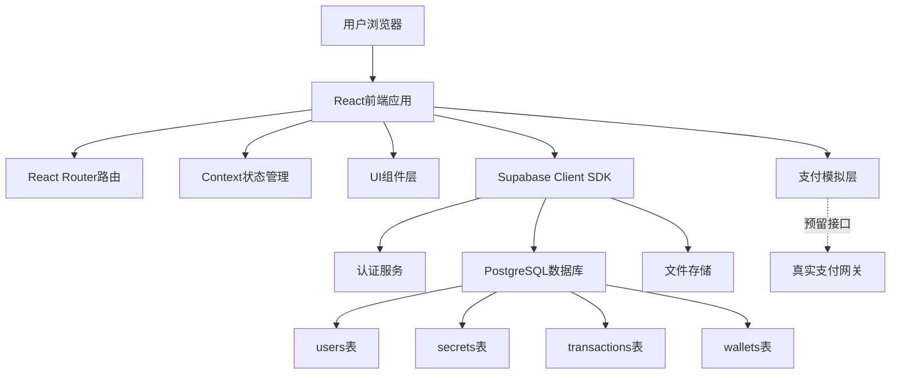

## 产品概述

一个匿名树洞社交平台，用户可以匿名分享秘密并设定打赏金额，其他用户通过随机"挖掘"方式发现秘密，选择是否付费支持，形成"倾诉-倾听-打赏"的情感互动闭环。

## 核心功能

### 倾诉树洞

- 用户匿名发布秘密内容
- 为秘密设定红包价格（0.1-99.99元）
- 秘密发布后进入公共池等待被发现
- 查看自己发布的树洞收益统计

### 倾听树洞

- 随机推送一个未查看的树洞秘密
- 展示部分内容预览（前50字）
- 选择是否支付查看完整内容
- 支付后可查看完整秘密并选择打赏

### 用户系统

- 匿名注册登录（仅需昵称+密码）
- 个人钱包（余额充值、收益提现）
- 历史记录（发布的树洞、购买的树洞）

### 支付系统

- 模拟支付流程（当前阶段）
- 预留真实支付接口（微信/支付宝）
- 资金流转记录和对账

## 技术栈选择

### 前端技术栈

- **框架**: React 18 + TypeScript
- **样式**: Tailwind CSS + CSS Modules
- **路由**: React Router v6
- **状态管理**: React Context API + Custom Hooks
- **HTTP客户端**: Axios
- **表单验证**: React Hook Form + Zod
- **动画效果**: Framer Motion

### 后端技术栈

- **BaaS平台**: Supabase
- PostgreSQL 数据库
- Row Level Security (RLS) 数据安全
- Realtime 实时订阅
- Auth 用户认证
- Storage 文件存储
- **支付模拟**: 本地Mock实现

### 部署方案

- **前端部署**: 使用 lighthouse 集成进行云端部署
- **成本优化**: Supabase免费计划（500MB数据库 + 1GB存储 + 50K月活用户）

## 实现方案

### 架构设计

#### 系统架构图



#### 数据库设计

**users 表** - 用户信息

```sql
- id: uuid (主键)
- nickname: text (昵称)
- avatar_url: text (头像)
- created_at: timestamp
```

**secrets 表** - 树洞秘密

```sql
- id: uuid (主键)
- user_id: uuid (外键 -> users.id)
- content: text (秘密内容)
- price: decimal (红包价格)
- preview: text (预览内容，前50字)
- view_count: int (查看次数)
- income: decimal (累计收益)
- status: enum (active/deleted)
- created_at: timestamp
```

**transactions 表** - 交易记录

```sql
- id: uuid (主键)
- secret_id: uuid (外键 -> secrets.id)
- buyer_id: uuid (外键 -> users.id)
- seller_id: uuid (外键 -> users.id)
- amount: decimal (交易金额)
- type: enum (view/tip)
- status: enum (pending/success/failed)
- created_at: timestamp
```

**wallets 表** - 用户钱包

```sql
- id: uuid (主键)
- user_id: uuid (外键 -> users.id, 唯一索引)
- balance: decimal (余额)
- total_income: decimal (总收益)
- total_expense: decimal (总支出)
- updated_at: timestamp
```

**user_secret_views 表** - 用户查看记录（防止重复推送）

```sql
- id: uuid (主键)
- user_id: uuid (外键)
- secret_id: uuid (外键)
- created_at: timestamp
- 联合唯一索引: (user_id, secret_id)
```

#### 前端路由设计

```
/ - 首页（未登录展示介绍页，已登录展示功能入口）
/login - 登录页
/register - 注册页
/confess - 倾诉树洞（发布秘密）
/listen - 倾听树洞（随机获取秘密）
/secret/:id - 秘密详情页（付费后查看）
/profile - 个人中心
  /profile/wallet - 我的钱包
  /profile/my-secrets - 我的倾诉
  /profile/purchased - 我的倾听
```

#### 组件架构

```
src/
├── components/
│   ├── common/          # 通用组件
│   │   ├── Button/
│   │   ├── Input/
│   │   ├── Modal/
│   │   └── Loading/
│   ├── layout/          # 布局组件
│   │   ├── Header/
│   │   ├── Footer/
│   │   └── Container/
│   └── features/        # 功能组件
│       ├── SecretCard/
│       ├── PaymentModal/
│       └── WalletPanel/
├── pages/               # 页面组件
├── contexts/            # Context状态
├── hooks/               # 自定义Hooks
├── services/            # API服务层
├── utils/               # 工具函数
└── types/               # TypeScript类型定义
```

## 实现细节

### 核心业务流程

#### 1. 倾诉流程

```
用户输入秘密内容 → 设定红包价格 → 敏感词过滤 → 
生成预览文本(前50字) → 存入secrets表 → 
初始化为active状态 → 返回发布成功
```

#### 2. 倾听流程

```
用户点击"倾听树洞" → 
查询未查看过的秘密(LEFT JOIN user_secret_views) → 
随机选择一条 → 展示预览内容和价格 → 
用户选择付费 → 验证钱包余额 → 
创建transaction记录 → 扣除买家余额 → 
增加卖家收益 → 记录查看历史 → 
展示完整秘密内容
```

#### 3. 支付流程（模拟版本）

```
触发支付 → 弹出支付模态框 → 
显示支付金额和订单信息 → 
用户点击"确认支付" → 
模拟延迟200ms → 
更新transaction状态为success → 
更新双方钱包余额 → 
返回支付成功状态
```

### 性能优化策略

1. **数据库查询优化**

- 在 secrets.status, secrets.created_at 上建立索引
- 在 user_secret_views (user_id, secret_id) 上建立联合索引
- 使用 Supabase RLS 策略替代应用层权限检查

2. **前端性能优化**

- React.lazy + Suspense 实现路由懒加载
- 使用 useMemo/useCallback 避免不必要的重渲染
- 虚拟滚动优化长列表渲染（历史记录页面）
- 图片懒加载和压缩

3. **缓存策略**

- 用户信息和钱包数据使用 Context 缓存
- Supabase Realtime 订阅钱包变化自动更新
- 树洞列表使用分页加载（每次20条）

### 安全性设计

1. **数据安全**

- 使用 Supabase RLS 确保用户只能操作自己的数据
- 敏感信息（如真实用户ID）不暴露到前端
- 秘密内容使用 PostgreSQL 加密存储

2. **支付安全**

- 所有金额计算在后端完成（使用 Supabase Functions）
- 交易原子性保证（使用数据库事务）
- 防止重复支付（transaction表唯一约束）

3. **内容审核**

- 敏感词过滤（本地词库 + 云端API）
- 用户举报机制（预留字段）
- 管理员审核后台（预留）

### 神秘森林主题设计

#### 视觉设计原则

- **色调**: 深灰色系为主（#1a1a1a, #2d2d2d, #3a3a3a）
- **点缀色**: 神秘蓝绿色（#2dd4bf, #14b8a6）、月光银（#cbd5e1）
- **背景**: 深色渐变 + 树木剪影 SVG
- **动效**: 轻微的呼吸动画、萤火虫飘动效果

#### 交互设计

- 树洞卡片采用毛玻璃效果（backdrop-filter: blur）
- 悬停时卡片轻微上浮 + 发光效果
- 页面切换使用淡入淡出过渡
- 支付成功时显示萤火虫飞舞动画

## 目录结构

### 项目完整结构

```
tree-hole-app/
├── public/
│   ├── index.html                    # HTML入口文件
│   ├── favicon.ico                   # 网站图标
│   └── assets/                       # 静态资源
│       ├── forest-bg.svg             # 森林背景SVG
│       └── firefly.svg               # 萤火虫图标
├── src/
│   ├── index.tsx                     # [NEW] React应用入口，渲染根组件，引入全局样式
│   ├── App.tsx                       # [NEW] 根组件，配置路由和全局Context Provider
│   ├── index.css                     # [NEW] 全局样式，Tailwind CSS导入和自定义样式
│   ├── components/
│   │   ├── common/
│   │   │   ├── Button/
│   │   │   │   ├── Button.tsx        # [NEW] 通用按钮组件，支持多种样式变体（primary/secondary/ghost）
│   │   │   │   └── Button.module.css # [NEW] 按钮样式，包含悬停发光效果
│   │   │   ├── Input/
│   │   │   │   ├── Input.tsx         # [NEW] 通用输入框组件，支持前缀图标和错误提示
│   │   │   │   └── Input.module.css  # [NEW] 输入框样式，深色主题设计
│   │   │   ├── Modal/
│   │   │   │   ├── Modal.tsx         # [NEW] 模态框组件，支持标题、内容、操作按钮
│   │   │   │   └── Modal.module.css  # [NEW] 模态框样式，毛玻璃效果背景
│   │   │   ├── Loading/
│   │   │   │   ├── Loading.tsx       # [NEW] 加载动画组件，萤火虫飘动效果
│   │   │   │   └── Loading.module.css # [NEW] 加载动画样式
│   │   │   └── Toast/
│   │   │       ├── Toast.tsx         # [NEW] 提示消息组件，支持success/error/info类型
│   │   │       └── Toast.module.css  # [NEW] 提示消息样式
│   │   ├── layout/
│   │   │   ├── Header/
│   │   │   │   ├── Header.tsx        # [NEW] 页面头部组件，包含导航和用户信息
│   │   │   │   └── Header.module.css # [NEW] 头部样式，固定定位和透明背景
│   │   │   ├── Footer/
│   │   │   │   ├── Footer.tsx        # [NEW] 页面底部组件，版权信息和链接
│   │   │   │   └── Footer.module.css # [NEW] 底部样式
│   │   │   └── Container/
│   │   │       ├── Container.tsx     # [NEW] 页面容器组件，统一内边距和最大宽度
│   │   │       └── Container.module.css # [NEW] 容器样式
│   │   └── features/
│   │       ├── SecretCard/
│   │       │   ├── SecretCard.tsx    # [NEW] 树洞卡片组件，展示秘密预览和价格，支持付费查看
│   │       │   └── SecretCard.module.css # [NEW] 卡片样式，毛玻璃效果和悬停动画
│   │       ├── PaymentModal/
│   │       │   ├── PaymentModal.tsx  # [NEW] 支付模态框组件，确认支付信息和执行支付操作
│   │       │   └── PaymentModal.module.css # [NEW] 支付模态框样式
│   │       └── WalletPanel/
│   │           ├── WalletPanel.tsx   # [NEW] 钱包面板组件，展示余额、收益、支出统计
│   │           └── WalletPanel.module.css # [NEW] 钱包面板样式
│   ├── pages/
│   │   ├── HomePage/
│   │   │   ├── HomePage.tsx          # [NEW] 首页组件，未登录展示介绍，已登录展示功能入口
│   │   │   └── HomePage.module.css   # [NEW] 首页样式，森林背景和渐变效果
│   │   ├── LoginPage/
│   │   │   ├── LoginPage.tsx         # [NEW] 登录页面，用户名密码登录表单
│   │   │   └── LoginPage.module.css  # [NEW] 登录页样式
│   │   ├── RegisterPage/
│   │   │   ├── RegisterPage.tsx      # [NEW] 注册页面，昵称密码注册表单
│   │   │   └── RegisterPage.module.css # [NEW] 注册页样式
│   │   ├── ConfessPage/
│   │   │   ├── ConfessPage.tsx       # [NEW] 倾诉页面，发布秘密和设定价格
│   │   │   └── ConfessPage.module.css # [NEW] 倾诉页样式，大文本输入框设计
│   │   ├── ListenPage/
│   │   │   ├── ListenPage.tsx        # [NEW] 倾听页面，随机展示树洞秘密预览
│   │   │   └── ListenPage.module.css # [NEW] 倾听页样式
│   │   ├── SecretDetailPage/
│   │   │   ├── SecretDetailPage.tsx  # [NEW] 秘密详情页，展示完整秘密内容
│   │   │   └── SecretDetailPage.module.css # [NEW] 秘密详情页样式
│   │   └── ProfilePage/
│   │       ├── ProfilePage.tsx       # [NEW] 个人中心页面，展示用户信息和导航
│   │       ├── ProfilePage.module.css # [NEW] 个人中心样式
│   │       ├── WalletTab.tsx         # [NEW] 钱包标签页，展示余额和交易记录
│   │       ├── MySecretsTab.tsx      # [NEW] 我的倾诉标签页，展示发布的树洞列表
│   │       └── PurchasedTab.tsx      # [NEW] 我的倾听标签页，展示购买的树洞列表
│   ├── contexts/
│   │   ├── AuthContext.tsx           # [NEW] 认证上下文，提供登录状态和用户信息
│   │   ├── WalletContext.tsx         # [NEW] 钱包上下文，提供钱包余额和交易方法
│   │   └── ToastContext.tsx          # [NEW] 提示消息上下文，全局消息提示管理
│   ├── hooks/
│   │   ├── useAuth.ts                # [NEW] 认证Hook，封装登录、注册、登出逻辑
│   │   ├── useWallet.ts              # [NEW] 钱包Hook，封装余额查询和交易操作
│   │   ├── useSecrets.ts             # [NEW] 树洞Hook，封装秘密的增删改查逻辑
│   │   └── usePayment.ts             # [NEW] 支付Hook，封装支付流程和状态管理
│   ├── services/
│   │   ├── supabase.ts               # [NEW] Supabase客户端初始化和配置
│   │   ├── authService.ts            # [NEW] 认证服务，提供登录注册API调用
│   │   ├── secretService.ts          # [NEW] 树洞服务，提供秘密CRUD操作
│   │   ├── walletService.ts          # [NEW] 钱包服务，提供钱包操作API
│   │   ├── transactionService.ts     # [NEW] 交易服务，提供交易记录操作
│   │   └── paymentService.ts         # [NEW] 支付服务，模拟支付流程，预留真实支付接口
│   ├── utils/
│   │   ├── contentFilter.ts          # [NEW] 内容过滤工具，敏感词检测和替换
│   │   ├── formatters.ts             # [NEW] 格式化工具，日期、金额格式化
│   │   ├── validators.ts             # [NEW] 验证工具，表单验证规则
│   │   └── constants.ts              # [NEW] 常量定义，价格范围、状态枚举等
│   ├── types/
│   │   ├── user.ts                   # [NEW] 用户相关类型定义
│   │   ├── secret.ts                 # [NEW] 树洞秘密类型定义
│   │   ├── transaction.ts            # [NEW] 交易记录类型定义
│   │   └── wallet.ts                 # [NEW] 钱包类型定义
│   └── assets/
│       └── styles/
│           ├── variables.css         # [NEW] CSS变量定义，颜色、字体、间距
│           └── animations.css        # [NEW] 动画定义，萤火虫飘动、呼吸效果
├── supabase/
│   ├── migrations/
│   │   └── 001_init_schema.sql      # [NEW] 数据库初始化脚本，创建表和索引
│   └── seed.sql                      # [NEW] 测试数据脚本，插入示例数据
├── .env.example                      # [NEW] 环境变量示例文件
├── .env.local                        # [NEW] 本地环境变量（包含Supabase配置）
├── .gitignore                        # [NEW] Git忽略配置
├── package.json                      # [NEW] 项目依赖和脚本配置
├── tsconfig.json                     # [NEW] TypeScript配置
├── tailwind.config.js                # [NEW] Tailwind CSS配置，自定义颜色和动画
├── postcss.config.js                 # [NEW] PostCSS配置
└── README.md                         # [NEW] 项目说明文档
```

## 关键代码结构

### 类型定义示例

```typescript
// src/types/secret.ts
export interface Secret {
  id: string;
  user_id: string;
  content: string;
  preview: string;
  price: number;
  view_count: number;
  income: number;
  status: 'active' | 'deleted';
  created_at: string;
}

export interface CreateSecretDto {
  content: string;
  price: number;
}
```

```typescript
// src/types/wallet.ts
export interface Wallet {
  id: string;
  user_id: string;
  balance: number;
  total_income: number;
  total_expense: number;
  updated_at: string;
}
```

```typescript
// src/types/transaction.ts
export interface Transaction {
  id: string;
  secret_id: string;
  buyer_id: string;
  seller_id: string;
  amount: number;
  type: 'view' | 'tip';
  status: 'pending' | 'success' | 'failed';
  created_at: string;
}
```

## 设计风格

采用"神秘森林树洞"主题的深色系设计，营造私密、安全、温暖的情感倾诉空间。

### 整体风格

- **主题**: 神秘森林夜景，深色系为主调
- **氛围**: 静谧、私密、温暖、治愈
- **元素**: 树木剪影、萤火虫、月光、树洞入口

### 页面布局

#### 首页（未登录）

- **顶部**: 透明导航栏，logo + "登录/注册"按钮
- **主视觉区**: 全屏森林夜景背景，中央显示产品slogan"在这里，秘密被温柔倾听"，两个大按钮"开始倾诉"和"去倾听"
- **特色介绍**: 三栏卡片，介绍"匿名安全"、"情感连接"、"温暖打赏"三大特点
- **底部**: 简洁footer，包含使用协议和联系方式

#### 首页（已登录）

- **顶部**: 固定导航栏，logo + 用户昵称 + 钱包余额 + "个人中心"
- **功能入口**: 两个大卡片，左侧"倾诉树洞"（绿色调），右侧"倾听树洞"（蓝色调），卡片采用毛玻璃效果，悬停发光
- **快速统计**: 显示"我的倾诉数"、"总收益"、"倾听数"三个数据卡片

#### 倾诉页面

- **布局**: 单栏居中布局，最大宽度800px
- **输入区**: 大文本框，placeholder"在这里倾诉你的秘密..."，支持500字输入
- **定价区**: 滑动条选择价格（0.1-99.99元），实时显示预览"设定红包 ¥X.XX"
- **操作区**: "发布到树洞"按钮（大号、发光效果）

#### 倾听页面

- **布局**: 居中卡片式布局
- **树洞卡片**: 毛玻璃效果，显示秘密预览（前50字，后面...），底部显示价格"¥X.XX 解锁完整内容"
- **操作按钮**: "支付查看"按钮和"换一个"按钮
- **空状态**: 显示"暂无新树洞，稍后再来"

#### 个人中心

- **顶部**: 用户信息卡片，头像 + 昵称 + 加入天数
- **钱包面板**: 余额、总收益、总支出，三个大数字卡片
- **标签页**: "我的倾诉"、"我的倾听"、"交易记录"三个tab
- **列表项**: 每个树洞/交易记录以卡片形式展示，包含内容预览、时间、金额

### 交互设计

- **页面切换**: 淡入淡出过渡（300ms）
- **卡片悬停**: 轻微上浮（translateY -4px）+ 边框发光
- **按钮点击**: 缩放动画（scale 0.95）
- **支付成功**: 萤火虫从卡片飞出的动画效果
- **加载状态**: 萤火虫飘动的loading动画

### 响应式设计

- **桌面端**: 最大宽度1200px，居中显示
- **平板端**: 适配768px-1024px，卡片布局调整为单列
- **移动端**: 适配375px-768px，全屏布局，导航栏收起为汉堡菜单

## 集成服务

### lighthouse

- **用途**: 用于前端项目的云端部署
- **使用场景**: 完成开发后，将React应用部署到云端lighthouse实例
- **预期结果**: 生成可访问的线上URL，供用户测试和使用